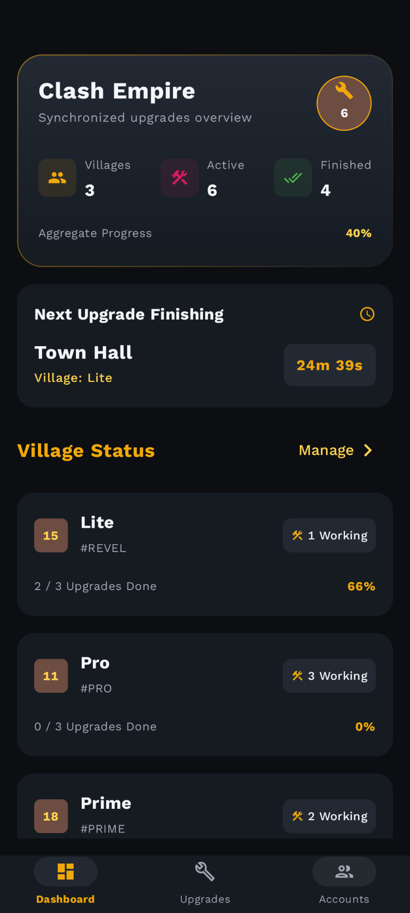
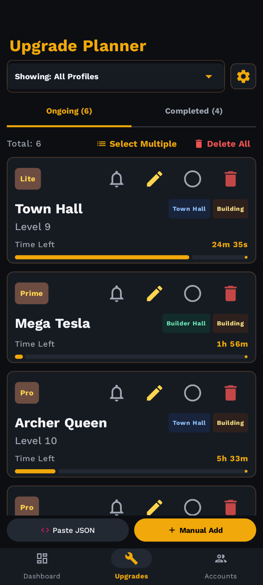
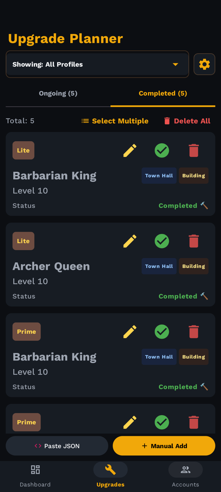
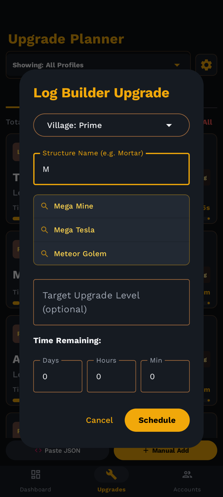
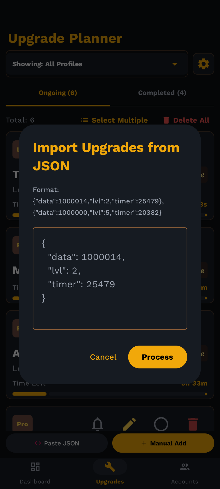
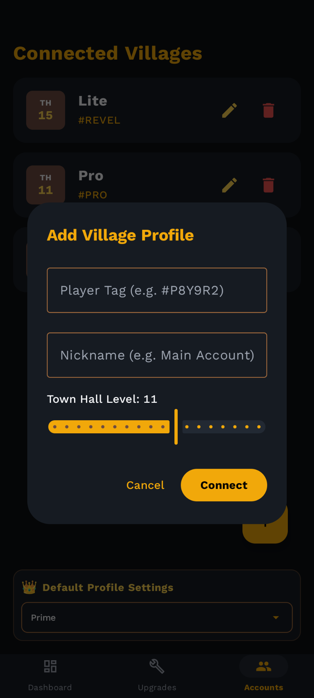
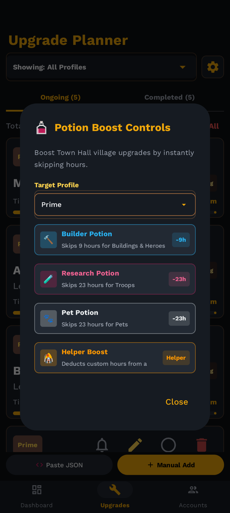
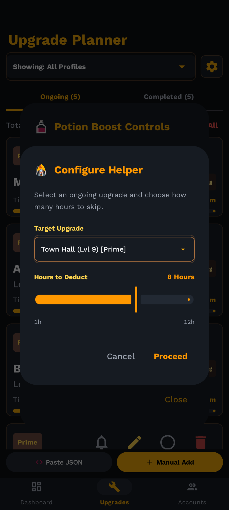

# Clash Tracker

Track Clash of Clans upgrades across multiple accounts, estimate completion times, and stay on top of your village progress. 

---

## 🚀 Key Features

*   **Multi-Village Dashboard**: Connect, view, and manage status overviews for multiple Clash of Clans profile accounts from a single unified hub.
*   **Active Upgrade Planner**: Track construction and research timers dynamically per village, ensuring your builders and laboratory never sit idle.
*   **Live Progress Notification**: Features real-time timers that count down to construction completion with support of Live Progress Notification.
*   **Intelligent JSON Import**: Easily copy and paste raw game-extracted upgrade JSON game data from settings to import in progress upgrades.
*   **"Next Builder" Visual Highlights**: Automatically scans your active timers to highlight which village and upgrade will complete next.
*   **Smart Auto-Fill Feature**: When typing a structure's name in either the manual upgrade addition or modification dialogs, the app now shows suggestions based on mapping names.
*   **Multi-Select & Bulk Deletion Engine**: Selection mode, presenting intuitive checkable states for each upgrade card to delete entries.
*   **Stored Village & Category Classifications**: villageType and categoryType fields to store upgrades classifications.
*   **Potion Boost Controls**: Integrate boosts from Builder Potion, Research Potion, Pet Potion for Town Hall village upgrades.
*   **Helper Boost**: applyHelperBoost to reduce upgrade duration by a specific number of hours.

---

## 🛠️ Built With

*   **Kotlin & Jetpack Compose**: High-performance modern Android UI engine.
*   **Jetpack Room**: Offline local database engine for robust data persistence.
*   **Kotlin Coroutines & Flow**: Reliable asynchronous streaming states and countdown background workers.
*   **Material Design 3 (M3)**: Fluid responsive components designed for dynamic light/dark palettes, accessibility, and high visual contrast.

---

## 📲 Screenshots 

---

## 🤖 AI Assistance Disclosure

This application has been developed with the assistance of advanced Google Artificial Intelligence models for debugging and some initial code structure. 
